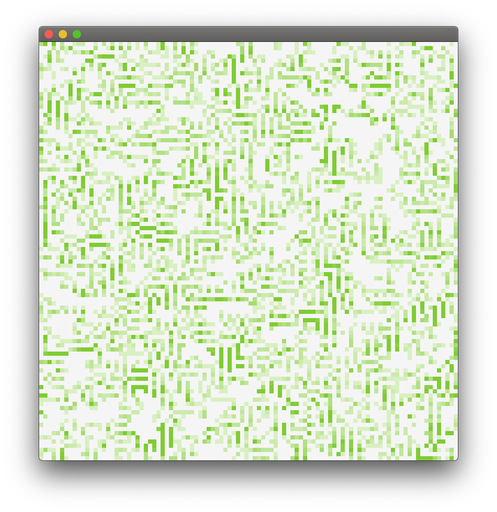

# Game of Life



From [Wikipedia](https://en.wikipedia.org/wiki/Conway%27s_Game_of_Life):

> The universe of the Game of Life is an infinite, two-dimensional orthogonal grid of square cells, each of which is in one of twopossible states, alive or dead, (or populated and unpopulated, respectively). Every cell interacts with its eight neighbors, *which are the cells that are horizontally, vertically, or diagonally adjacent.

Build system is [Mill](http://www.lihaoyi.com/mill/). You'll need that before you can run this. Then simply:

```
:>mill -w gameOfLife
```

Tests can be run like so:

```
:>mill -w gameOfLife.test
```
